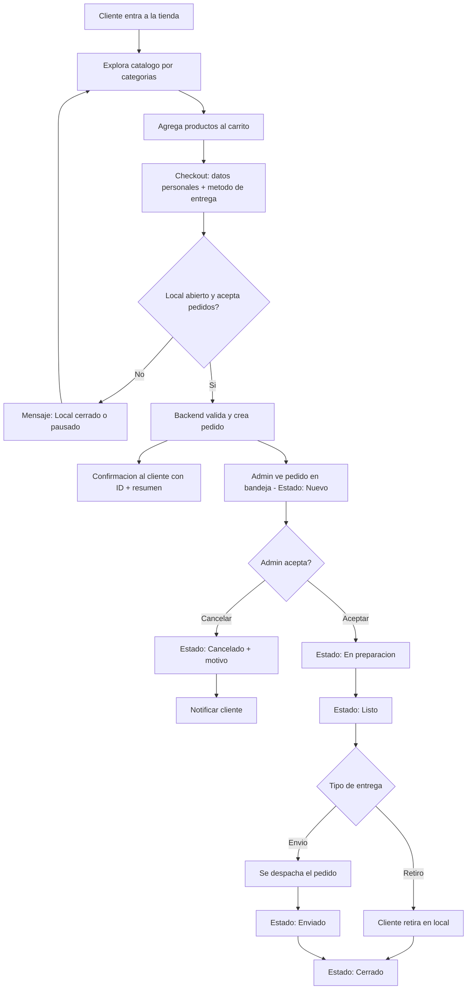

# Proyecto Consolidado: Sistema de Pedidos y Gestion Comercial
## Local Minorista + Evolucion B2B + Vision Marketplace (Necochea)

**Fecha:** 2026-02-07
**Estado:** documento maestro para alineacion interna y derivacion comercial
**Autores:** equipo de desarrollo (consolidacion de brainstorming conjunto)

---

## Indice

1. [Para que sirve este documento](#1-para-que-sirve-este-documento)
2. [Contexto del negocio](#2-contexto-del-negocio)
3. [Problemas actuales y valor que entregamos](#3-problemas-actuales-y-valor-que-entregamos)
4. [Principio rector del proyecto](#4-principio-rector-del-proyecto)
5. [Estrategia por fases](#5-estrategia-por-fases)
6. [Alcance detallado por fase](#6-alcance-detallado-por-fase)
7. [Requisitos funcionales de Fase 1](#7-requisitos-funcionales-de-fase-1)
8. [Requisitos no funcionales](#8-requisitos-no-funcionales)
9. [Reglas de negocio de Fase 1](#9-reglas-de-negocio-de-fase-1)
10. [Modelo de datos](#10-modelo-de-datos)
11. [API minima sugerida](#11-api-minima-sugerida)
12. [Flujo de pedido](#12-flujo-de-pedido)
13. [Arquitectura: opciones y decision](#13-arquitectura-opciones-y-decision)
14. [Entregables formales](#14-entregables-formales)
15. [Cronograma de referencia](#15-cronograma-de-referencia)
16. [Presupuesto por escenarios](#16-presupuesto-por-escenarios)
17. [Modelo comercial y condiciones](#17-modelo-comercial-y-condiciones)
18. [Propiedad intelectual y licenciamiento](#18-propiedad-intelectual-y-licenciamiento)
19. [Exclusiones explicitas](#19-exclusiones-explicitas)
20. [Riesgos y mitigacion](#20-riesgos-y-mitigacion)
21. [Decisiones pendientes](#21-decisiones-pendientes)
22. [KPIs sugeridos](#22-kpis-sugeridos)
23. [Criterios Go/No-Go para lanzar Fase 1](#23-criterios-gono-go-para-lanzar-fase-1)
24. [Guion de presentacion al cliente](#24-guion-de-presentacion-al-cliente)
25. [Recomendacion final y proximos pasos](#25-recomendacion-final-y-proximos-pasos)

---

## 1) Para que sirve este documento

Este documento unifica todo el trabajo de brainstorming de ambos socios en un unico plan ejecutable. Sirve para:

- **Alineacion interna:** que ambos socios esten de acuerdo en enfoque, fases, tecnologia y numeros antes de presentar al cliente.
- **Base para propuesta comercial:** derivar de aca una version corta (1-2 paginas) orientada al cliente.
- **Base para ejecucion tecnica:** derivar tickets, backlog y criterios de aceptacion.
- **Registro de decisiones:** documentar que se eligio, que se descarto y por que.

No es un documento para enviar al cliente tal cual. Es el documento madre del que salen los demas.

---

## 2) Contexto del negocio

### El cliente

- Tiene un **local a la calle en Necochea** que vende:
  - Comidas preparadas
  - Helados
  - Mercaderia general (kiosco)
  - Alfajores (fabricacion propia familiar)
- Su padre tiene una **distribuidora y fabrica de alfajores** y tambien produce **helados de agua**.
- El canal mayorista (alfajores a comercios) es una linea de negocio activa pero gestionada de forma manual.

### Situacion actual

- Los pedidos llegan por **WhatsApp, llamadas y mostrador** sin trazabilidad unificada.
- Existe un software legacy llamado **DataLife** (o similar) que **no se usa activamente**.
- No hay canal digital propio; la unica presencia online son apps de terceros con comisiones altas (tipo PedidosYa 20-30%).
- Las operaciones de stock entre local y mayorista no estan sincronizadas.

### Vision del cliente

- Crear una **tienda online propia** tipo "PedidosYa pero solo de su local" para empezar.
- A futuro, escalar a algo mas grande: incorporar la distribuidora (B2B) y eventualmente abrir la plataforma a otros comercios de Necochea.

---

## 3) Problemas actuales y valor que entregamos

### Problemas

| Problema | Impacto |
|---|---|
| Pedidos por multiples canales sin sistema | errores, pedidos perdidos, duplicaciones |
| Sin trazabilidad de estados de pedido | el cliente no sabe en que estado esta su pedido |
| Stock desconectado entre mostrador y digital | quiebres, sobreventa, faltantes |
| Dependencia de plataformas con comisiones | 20-30% por cada venta, sin control de datos |
| Mayorista gestionado por WhatsApp | errores de anotacion, tiempos muertos, sin historial |

### Valor que entregamos

| Valor | Descripcion |
|---|---|
| Canal propio sin comisiones | cada venta es 100% del cliente, sin intermediarios |
| Operacion ordenada | estados claros de pedido de punta a punta |
| Verdad unica del stock | si se vende el ultimo helado en mostrador, se pausa en la app automaticamente |
| Base de datos propia | el cliente es dueno de sus datos de clientes, ventas e historial |
| Eficiencia mayorista | los comercios compran 24/7 sin que el cliente atienda telefono |
| Marketing directo | notificaciones push, promos, sin depender de terceros |
| Escalabilidad real | base tecnica para B2B y multi-comercio sin reescribir |

---

## 4) Principio rector del proyecto

> **Primero vender y operar bien. Despues escalar.**

No construir marketplace desde el dia 1. Un marketplace tipo PedidosYa desde el comienzo explota en complejidad:
- roles y permisos multi-comercio
- onboarding de comercios terceros
- pagos, retenciones, liquidaciones, comisiones
- logistica multi-origen
- soporte y reclamos centralizados
- administracion y auditoria central

Todo eso se aborda **solo si el negocio lo justifica con traccion real**.

---

## 5) Estrategia por fases

```
Fase 0 -> Fase 1 -> Fase 1.5 -> Fase 2 -> Fase 3
Discovery   MVP      Operacion    B2B      Marketplace
(1-2 sem)  (6-8 sem) (2-4 sem)  (4-6 sem)  (futuro)
```

Cada fase tiene alcance cerrado, presupuesto propio y entregables concretos. No se compromete una fase futura hasta cerrar la anterior.

---

## 6) Alcance detallado por fase

### Fase 0 - Discovery (1-2 semanas)

**Objetivo:** eliminar incertidumbre, cerrar reglas y congelar alcance del MVP.

**Actividades:**
- Relevamiento funcional y operativo del local
- Definicion de reglas criticas: delivery, horarios, minimos, datos del cliente, estados
- Prototipo rapido del flujo principal (catalogo -> carrito -> checkout -> panel admin)
- Backlog priorizado con historias de usuario

**Entregables:**
- Documento de alcance MVP firmado
- Mapa de procesos actual y objetivo
- Prototipo UX de flujo principal
- Roadmap por fases con hitos
- Presupuesto final cerrado por etapa

**Modelo:** fase paga (USD 500 - 1,500), descontable si se contrata el proyecto completo.

---

### Fase 1 - MVP Single-Store (6-8 semanas)

**Objetivo:** vender online desde el local con operacion estable de punta a punta.

#### Lo que SI incluye

**Cliente (B2C - web app mobile-first):**
- Catalogo por categorias (Comidas / Helados / Mercaderia / Alfajores)
- Detalle de producto: nombre, descripcion, precio, imagen, disponibilidad
- Variantes simples opcionales (tamano, sabor, pack) con ajuste de precio
- Observaciones del cliente por item (texto libre, max 250 chars)
- Carrito: agregar/quitar items, modificar cantidad, ver subtotal + envio
- Checkout: nombre, telefono, metodo de entrega
  - Si envio: direccion, referencias, barrio/zona
  - Opcion "Lo antes posible" o franja horaria (si se habilita)
- Confirmacion de pedido con ID y estado "Nuevo"
- Link a WhatsApp para consultas (opcional MVP)

**Admin del local (panel web):**
- Login seguro para admin
- Bandeja de pedidos por estado: `Nuevo -> En preparacion -> Listo -> Enviado/Retirado -> Cerrado`
- Flujo alternativo: `Cancelado` con motivo
- Detalle completo de cada pedido (items, observaciones, datos cliente, entrega)
- Cambio de estado con timestamp
- CRUD de productos: nombre, descripcion, precio, categoria, imagen, habilitado/pausado
- CRUD de categorias
- Configuracion del local:
  - Horarios de apertura/cierre por dia
  - Pausar pedidos manualmente ("modo cerrado")
  - Opciones de entrega: retiro / envio
  - Costo de envio: fijo o por zona (lista simple)

#### Lo que NO incluye en Fase 1

- Marketplace multi-comercio
- Tracking de repartidor en mapa
- AFIP, facturacion electronica, contabilidad
- Integracion profunda con DataLife (salvo API clara y prioridad acordada)
- Stock perfecto en tiempo real con movimientos completos
- Promociones complejas, cupones, puntos de fidelidad
- Pagos online (MercadoPago se evalua en Fase 1.5)

---

### Fase 1.5 - Mejoras operativas (2-4 semanas)

**Objetivo:** mejorar la operacion con datos reales de uso.

- Integracion MercadoPago
- Comanda / impresion operativa (si el local lo necesita)
- Reportes base: ventas por dia, por producto, ticket promedio
- Ajustes de UX y performance segun feedback real de usuarios
- Notificaciones mejoradas (email / push / SMS segun costo/valor)
- "Reordenar" (repetir ultimo pedido)

---

### Fase 2 - B2B Mayorista (4-6 semanas)

**Objetivo:** habilitar canal de pedidos mayoristas con reglas propias.

- Login cerrado: solo clientes aprobados por el administrador
- Catalogo B2B con precios mayoristas y presentaciones (caja, bulto, docena)
- Listas de precio por cliente o por rubro
- Minimos de compra y condiciones comerciales
- Historial de pedidos y "repetir pedido" con un clic
- Entrega programada (seleccion de fecha/horario)
- Notificacion cuando el pedido esta aprobado
- Base para cuenta corriente / credito (modulo adicional si se contrata)

**Variante de ahorro:** iniciar B2B como web responsive en lugar de app nativa, ahorrando costo significativo.

**Evolutivo B2B (no incluido, cotizar aparte):**
- Cuenta corriente con gestion de credito y saldo
- Facturacion electronica / integracion AFIP
- Descarga de remitos/facturas en PDF
- Ruteo de reparto (optimizacion de recorridos)

---

### Fase 3 - Marketplace multi-comercio (posterior, no comprometida)

**Solo se activa si hay traccion real y demanda de otros comercios en Necochea.**

- Multi-store real (cada comercio con su catalogo y panel)
- Onboarding de comercios nuevos
- Comisiones y liquidaciones
- Soporte y reclamos centralizados
- Administracion central de la plataforma

---

## 7) Requisitos funcionales de Fase 1

### 7.1 Cliente final (B2C)

| ID | Requisito | Detalle |
|---|---|---|
| RF-C1 | Catalogo | Ver productos por categoria con detalle (nombre, precio, imagen, disponibilidad) |
| RF-C2 | Variantes | Opciones simples (tamano, sabor, pack) con ajuste de precio |
| RF-C3 | Observaciones | Texto libre por item (max 250 chars) |
| RF-C4 | Carrito | Agregar/quitar items, modificar cantidad, ver subtotal + envio |
| RF-C5 | Checkout | Datos minimos: nombre, telefono, entrega. Si envio: direccion + referencias |
| RF-C6 | Franja horaria | "Lo antes posible" o franja (si se habilita en F1) |
| RF-C7 | Confirmacion | Pantalla "Pedido recibido" con ID, estado "Nuevo", resumen |
| RF-C8 | Consulta | Link a WhatsApp para dudas (opcional MVP) |

### 7.2 Admin del local

| ID | Requisito | Detalle |
|---|---|---|
| RF-A1 | Login | Acceso restringido a usuarios admin |
| RF-A2 | Bandeja de pedidos | Lista por estado con detalle completo |
| RF-A3 | Gestion de estados | Cambiar estado con click y timestamp |
| RF-A4 | Cancelacion | Marcar cancelado con motivo (texto corto) |
| RF-A5 | CRUD productos | Nombre, descripcion, precio, categoria, imagen, habilitado/pausado |
| RF-A6 | CRUD categorias | Crear/editar/desactivar categorias |
| RF-A7 | Horarios | Configurar apertura/cierre por dia de la semana |
| RF-A8 | Pausa manual | Modo "cerrado" independiente del horario |
| RF-A9 | Delivery | Configurar retiro/envio y costo (fijo o por zona) |

---

## 8) Requisitos no funcionales

| ID | Requisito | Criterio |
|---|---|---|
| RNF-1 | Performance | Catalogo carga rapido en movil (LCP razonable) |
| RNF-2 | Mobile-first | Disenado primero para celular, funciona en desktop |
| RNF-3 | Seguridad | Panel admin protegido; validacion server-side de precios/totales; rate limiting basico |
| RNF-4 | Auditabilidad | Logs minimos de cambios de estado de pedidos (timestamps) |
| RNF-5 | Extensibilidad | Modelo DB con `store_id` en toda entidad principal (preparado para multi-store) |
| RNF-6 | Disponibilidad | Tolerar picos pequenos (fines de semana, feriados) |
| RNF-7 | Backups | Backup diario de base de datos y monitoreo basico en produccion |

---

## 9) Reglas de negocio de Fase 1

1. **Local cerrado = no se acepta pedido.** Si el local esta fuera de horario o en pausa manual, el checkout bloquea con mensaje claro. (Excepcion futura: pedido programado.)
2. **Costo de envio por regla simple.** Fijo o por zona segun configuracion del admin. No hay calculo por distancia/radio en F1.
3. **Pedido minimo para envio (opcional).** Si existe, bloquear checkout de envio si no se cumple.
4. **Backend = fuente de verdad.** Al crear pedido, el backend vuelve a buscar productos en DB, recalcula totales y aplica reglas (envio, minimos, horarios). Se guardan snapshots de nombre y precio en cada OrderItem. Esto evita manipulacion del carrito/precios desde el cliente.
5. **Pago en F1: efectivo o transferencia.** Pagos online se evaluan en Fase 1.5.

---

## 10) Modelo de datos

### Entidades principales (Fase 1)

| Entidad | Campos clave | Notas |
|---|---|---|
| `stores` | id, name, slug, settings (horarios, pausa, delivery_rules) | Aunque haya 1 solo store, se modela asi para escalar |
| `users` | id, store_id, role (customer / store_admin / platform_admin futuro) | platform_admin se activa en Fase 3 |
| `categories` | id, store_id, name, order, enabled | Orden para mostrar en catalogo |
| `products` | id, store_id, category_id, name, description, price, image_url, enabled | enabled = habilitado/pausado |
| `product_variants` | id, product_id, name, price_delta, enabled | Opcional en F1; si complejiza, se posterga a F1.5 |
| `orders` | id, store_id, status, subtotal, delivery_fee, total, delivery_type, delivery_address, customer_name, customer_phone, notes, created_at | Totales calculados por backend |
| `order_items` | id, order_id, product_id, product_name_snapshot, product_price_snapshot, qty, variant_snapshot, item_notes | Snapshots preservan datos al momento de compra |
| `order_status_history` | id, order_id, status, changed_by, reason, timestamp | Historial completo de cambios de estado |
| `store_settings` | id, store_id, schedule (JSON por dia), paused, delivery_enabled, pickup_enabled, delivery_fee_type, delivery_fee_config | Configuracion operativa del local |

### Entidades adicionales para Fase 2 (B2B)

- `wholesale_customers` (datos de empresa, CUIT, condiciones, lista de precio asignada)
- `price_lists` (listas de precio mayorista por cliente/rubro)
- `credit_accounts` (cuenta corriente, saldo, limite, si se contrata)

---

## 11) API minima sugerida

### Endpoints publicos (storefront)

| Metodo | Ruta | Descripcion |
|---|---|---|
| GET | `/catalog` | Catalogo completo por categorias |
| GET | `/products/:id` | Detalle de producto con variantes |
| GET | `/store/status` | Estado actual del local (abierto/cerrado/pausado) |
| POST | `/orders` | Crear pedido (backend valida y recalcula totales) |
| GET | `/orders/:id/status` | Consultar estado de un pedido por ID |

### Endpoints admin (protegidos)

| Metodo | Ruta | Descripcion |
|---|---|---|
| POST | `/auth/admin/login` | Autenticacion de admin |
| GET | `/admin/orders` | Listar pedidos (filtros por estado, fecha) |
| GET | `/admin/orders/:id` | Detalle completo de un pedido |
| PATCH | `/admin/orders/:id/status` | Cambiar estado de pedido |
| GET | `/admin/products` | Listar productos |
| POST | `/admin/products` | Crear producto |
| PATCH | `/admin/products/:id` | Editar producto |
| DELETE | `/admin/products/:id` | Baja logica de producto |
| GET | `/admin/categories` | Listar categorias |
| POST | `/admin/categories` | Crear categoria |
| PATCH | `/admin/categories/:id` | Editar categoria |
| PATCH | `/admin/store/settings` | Modificar configuracion del local |

**Regla no negociable:** backend recalcula y valida totales, precios y reglas en cada `POST /orders`. Nunca confiar en datos del cliente.

---

## 12) Flujo de pedido

### Diagrama del flujo principal



### Estados del pedido

```
Nuevo -> En preparacion -> Listo -> Enviado/Retirado -> Cerrado
                                      |
                                  Cancelado (en cualquier punto previo a Cerrado)
```

Cada transicion genera un registro en `order_status_history` con timestamp y usuario.

---

## 13) Arquitectura: opciones y decision

### Opcion A - Astro + React Islands + API Node/Express separada

| Aspecto | Detalle |
|---|---|
| Frontend | Astro (SSG/SEO-first) + Tailwind + React solo donde hay interactividad (carrito, checkout, admin) |
| Backend | Node.js + Express + Prisma (MVC) |
| DB | PostgreSQL |
| Deploy | Frontend en CDN (Vercel/Cloudflare). Backend como servicio (Render/Railway/Fly). |

**Pros:**
- Storefront ultra rapido y SEO-friendly (HTML-first, JS minimo)
- API completamente separada y reutilizable para mobile futuro
- Control fino del JS enviado al cliente
- React no "contamina" todo el render; solo se activa donde hay interactividad real

**Contras:**
- Mas piezas operativas (frontend + backend separados)
- Mayor friccion en auth, CORS y configuracion de despliegue
- Dos proyectos que mantener

### Opcion B - Next.js Fullstack (App Router)

| Aspecto | Detalle |
|---|---|
| Frontend + Backend | Next.js con App Router (UI + API Routes) |
| ORM | Prisma |
| DB | PostgreSQL (Neon/Supabase) |
| Deploy | Vercel (todo unificado) |

**Pros:**
- Menor complejidad operativa (una sola app)
- Menor overhead de integracion (auth, routing, deploy unificados)
- Velocidad para entregar MVP si el equipo ya maneja Next
- ISR/SSR para catalogo con buen SEO

**Contras:**
- Si no se optimiza bien, puede sentirse pesado
- Menor separacion explicita de capas desde el dia 1
- API menos "limpia" para reutilizar en mobile futuro (aunque se puede)

### Matriz de decision (1 a 5, mayor es mejor)

| Criterio | Peso | Opcion A (Astro+API) | Opcion B (Next) |
|---|---:|---:|---:|
| Time-to-market MVP | 5 | 3 | 5 |
| Simplicidad operativa | 4 | 3 | 5 |
| Performance storefront | 4 | 5 | 4 |
| SEO | 3 | 5 | 4 |
| Reuso API para mobile | 3 | 5 | 4 |
| Curva del equipo actual | 4 | 4 | 5 |
| **Total ponderado** | | **88** | **106** |

### Interpretacion

Para una Fase 1 acotada donde la prioridad es **entregar rapido y con bajo riesgo operativo**, hoy favorece **Opcion B (Next.js Fullstack)**.

La Opcion A se vuelve mas competitiva si:
- La prioridad maxima es performance/SEO del storefront
- Se quiere API completamente separada desde el dia 1 para mobile/integraciones
- El equipo ya tiene experiencia con Astro

**La decision final se toma en la reunion interna de socios.**

### Stack comun (independiente de la opcion)

- **ORM:** Prisma
- **DB:** PostgreSQL
- **Auth:** JWT + roles (customer / store_admin / platform_admin)
- **Uploads:** Cloudinary o Supabase Storage (en DB solo URLs)
- **CSS:** Tailwind

---

## 14) Entregables formales

Lista de entregables del proyecto completo (Discovery + Fase 1 como minimo):

| # | Entregable | Fase |
|---|---|---|
| 1 | Documento de requerimientos y reglas de negocio | Discovery |
| 2 | Mapa de procesos actual y objetivo | Discovery |
| 3 | Prototipo UX de flujo principal | Discovery |
| 4 | Backlog priorizado | Discovery |
| 5 | Cronograma y presupuesto cerrado | Discovery |
| 6 | Base de datos y migraciones | F1 |
| 7 | Backend/API funcional | F1 |
| 8 | Frontend cliente (storefront) operativo | F1 |
| 9 | Panel admin operativo | F1 |
| 10 | Testing funcional end-to-end | F1 |
| 11 | Despliegue a produccion | F1 |
| 12 | Capacitacion al personal del local | F1 |
| 13 | Guia breve de uso (admin) | F1 |
| 14 | Soporte post salida (periodo acordado) | F1 |

---

## 15) Cronograma de referencia

### Ruta recomendada: Discovery + Fase 1 (8-10 semanas)

| Semana | Actividad |
|---|---|
| 1-2 | **Discovery:** relevamiento, reglas, prototipo, backlog, presupuesto cerrado |
| 3-4 | **Desarrollo core:** base de datos, autenticacion admin, catalogo y productos |
| 5-6 | **Flujo de compra:** carrito, checkout, creacion de pedidos, panel de pedidos y estados |
| 7 | **Config operativa:** store settings (horarios, pausa, envio), CRUD completo |
| 8 | **QA funcional:** testing end-to-end, ajustes |
| 9 | **Salida:** despliegue, capacitacion, lanzamiento controlado |
| 10 | **Buffer:** margen para ajustes post-lanzamiento |

### Ruta extendida (si se incluye UX/UI formal y mas QA)

14-18 semanas incluyendo fase de diseno UX/UI formal con mockups navegables, QA ampliado con pruebas de estres, y salida mas gradual.

---

## 16) Presupuesto por escenarios

### Escenarios del equipo (basados en stack y capacidad propia)

| Escenario | Incluye | Rango USD |
|---|---|---|
| **A - Entrada controlada** (recomendado para cerrar) | Discovery + Fase 1 | 6,000 - 10,000 |
| **B - Operacion consolidada** | Discovery + F1 + F1.5 | 10,000 - 16,000 |
| **C - Expansion B2B** | Discovery + F1 + F1.5 + F2 | 16,000 - 26,000 |

### Referencia de mercado (bandas amplias, para negociacion)

| Paquete | Rango USD |
|---|---|
| MVP Operativo (admin + stock + pedidos basicos) | 8,000 - 15,000 |
| Estandar (MVP + mejoras, reportes, zonas, roles) | 15,000 - 25,000 |
| Premium (estandar + pagos, ruteo, B2B completo, integraciones) | 25,000 - 40,000+ |

**Recomendacion:** usar los escenarios propios como precio base y las bandas de mercado como referencia de negociacion. Cerrar precio final despues de Discovery.

### Costos recurrentes mensuales

| Concepto | Rango USD/mes |
|---|---|
| Infraestructura (hosting, backups, monitoreo) | 30 - 120 |
| Servicios (notificaciones, email, SMS) | 10 - 30 |
| Soporte y mantenimiento tecnico | 120 - 350 |
| **Total mensual estimado** | **160 - 500** |

### Desglose orientativo por modulo (referencia para armar presupuesto detallado)

| Modulo | Rango USD |
|---|---|
| Discovery (relevamiento + prototipo + backlog) | 500 - 1,500 |
| Base de datos + backend + API | 2,500 - 5,000 |
| Frontend storefront (B2C) | 1,500 - 3,000 |
| Panel admin | 1,000 - 2,000 |
| Integracion MercadoPago (F1.5) | 500 - 1,000 |
| Modulo B2B (F2) | 2,500 - 4,500 |
| Deploy + capacitacion | 500 - 1,000 |

---

## 17) Modelo comercial y condiciones

| Concepto | Detalle |
|---|---|
| **Modalidad** | Por hitos (fases) con entregas parciales |
| **Anticipo** | 30% al inicio del proyecto |
| **Esquema de pagos** | 30% inicio + 30% aprobacion UX/flujo funcional + 30% entrega funcional completa + 10% salida productiva |
| **Garantia** | 30 dias de correccion de errores post salida (no incluye nuevas funcionalidades) |
| **Cambios de alcance** | Se gestionan como adicionales formales con presupuesto propio |
| **Discovery** | Fase paga y descontable del total si se contrata el proyecto completo |
| **Soporte** | Plan mensual a acordar (bolsa de horas o abono fijo) |
| **Moneda** | USD o ARS al tipo de cambio acordado al momento de firma |

---

## 18) Propiedad intelectual y licenciamiento

Este punto se define **antes de cerrar presupuesto final** y debe figurar en propuesta + contrato.

### Esquema recomendado para este caso (ticket inicial bajo)

- El cliente es dueno de:
  - su marca, dominio y contenido
  - sus datos operativos (clientes, pedidos, catalogo, configuraciones)
  - su operacion diaria sobre su instancia/sistema dedicado
- El equipo desarrollador conserva:
  - propiedad del core reutilizable (codigo base, arquitectura, componentes comunes)
  - derecho de reutilizar ese core en otros clientes/proyectos
  - operacion/control de la futura capa marketplace multi-comercio

### Derechos de uso para el cliente

- Licencia de uso del sistema para su negocio.
- Continuidad operativa sujeta al acuerdo de mantenimiento/servicio.
- Exportacion de datos del cliente garantizada en formato acordado.

### Escalado futuro a marketplace (Fase 3)

- Si se escala a multi-comercio, la plataforma se opera bajo titularidad o control mayoritario del equipo desarrollador.
- El cliente fundador puede recibir beneficio preferencial:
  - comision reducida o bonificada por periodo inicial
  - prioridad comercial como comercio ancla

### Momento para hablarlo con el cliente

1. Discovery: presentar el esquema preliminar.
2. Propuesta final: agregar anexo corto de propiedad/licencia.
3. Contrato (antes del anticipo): clausulas firmadas.

### Regla de negociacion

- No prometer "propiedad total del software" con ticket de implementacion bajo.
- Separar claramente "propiedad de datos del cliente" de "propiedad del core de plataforma".

---

## 19) Exclusiones explicitas

Para evitar malentendidos, lo siguiente **NO esta incluido** salvo acuerdo y presupuesto adicional:

- Integracion con AFIP / facturacion electronica
- Impresoras fiscales o hardware POS especifico
- Sistema contable completo (asientos, balances)
- Marketplace multi-local en Fase 1 (es Fase 3)
- Integracion con sistemas ERP externos
- Integracion profunda con DataLife (salvo API disponible y prioridad acordada)
- Stock perfecto con movimientos por deposito/merma/devolucion (es mejora futura)
- App mobile nativa (React Native) en Fase 1 (es evolutivo)
- Seguimiento de repartidor en mapa
- Programa de fidelidad y puntos

---

## 20) Riesgos y mitigacion

| # | Riesgo | Impacto | Probabilidad | Mitigacion |
|---|---|---|---|---|
| 1 | Querer incluir demasiado en Fase 1 | Atrasos y sobrecostos | Alta | Recorte estricto del MVP; decir "no" a scope creep |
| 2 | Reglas de stock mal definidas | Errores operativos, descuadres | Media | Taller de procesos obligatorio en Discovery |
| 3 | Cambios constantes del cliente | Deriva de alcance y presupuesto | Alta | Backlog firmado por fase; cambios como adicionales |
| 4 | Integraciones fiscales/contables no planificadas | Alta complejidad imprevista | Media | Dejar fuera de MVP y cotizar como modulo aparte |
| 5 | Arquitectura muy compleja para F1 | Menor velocidad de entrega | Baja | Elegir stack mas simple para F1; optimizar despues |
| 6 | Menu que cambia por dia (comidas) | Complejidad de gestion diaria | Media | Definir en Discovery si aplica; simplificar regla |
| 7 | Logistica especial de helados | Restricciones de tiempo/temperatura | Baja | Definir franjas y restricciones en Discovery |
| 8 | DataLife requiere integracion | Complejidad por sistema legacy | Baja | No tocar salvo necesidad demostrada y API disponible |
| 9 | Confusion sobre propiedad/licencia | Conflicto comercial o legal | Media | Definir clausulas de propiedad y uso desde Discovery |

---

## 21) Decisiones pendientes

Estas decisiones deben resolverse **antes de firmar alcance de Fase 1**, idealmente en Discovery o en reunion interna previa:

| # | Decision | Opciones | Impacto |
|---|---|---|---|
| 1 | Arquitectura Fase 1 | Opcion A (Astro+API) vs Opcion B (Next fullstack) | Define stack, deploy y velocidad |
| 2 | Checkout | Con cuenta obligatoria vs invitado (solo nombre+telefono) | Friccion del usuario vs datos |
| 3 | Pago inicial | Solo efectivo/transferencia vs incluir MercadoPago en F1 | Complejidad de integracion |
| 4 | Delivery | Costo fijo vs por zona vs por radio | Complejidad de configuracion |
| 5 | Horarios | Solo "lo antes posible" vs tambien pedido programado | Complejidad de flujo |
| 6 | Menu variable | Menu fijo vs menu que cambia por dia (comidas) | Impacta CRUD y UX |
| 7 | Mayorista en F1 | Solo catalogo informativo vs micro flujo de consulta | Alcance de F1 |
| 8 | Reportes minimos | Cuales son imprescindibles para primer release | Esfuerzo de desarrollo |
| 9 | Soporte mensual | Que politica ofrecer y a que precio | Propuesta comercial |
| 10 | Variantes en F1 | Incluir variantes simples o postergar a F1.5 | Complejidad del carrito |
| 11 | Modelo de licencia | Alcance de uso, continuidad y salida de datos | Evita conflictos futuros |
| 12 | Beneficio fundador | Comision reducida/bonificada para primer comercio | Facilita cierre comercial |

---

## 22) KPIs sugeridos

Metricas para medir el exito del MVP una vez lanzado:

| KPI | Que mide | Meta orientativa |
|---|---|---|
| Pedidos por dia | Adopcion del canal digital | Crecimiento semanal sostenido |
| Tasa de conversion | Visitas al catalogo que terminan en pedido | > 3-5% |
| Ticket promedio | Valor promedio de cada pedido | Definir con datos reales |
| Tiempo de confirmacion | Cuanto tarda admin en aceptar pedido | < 5 minutos |
| % pedidos cancelados | Problemas operativos o de UX | < 10% |
| % retiro vs envio | Preferencia de los clientes | Solo para entender el mix |
| Tiempo de preparacion | De "En preparacion" a "Listo" | Medir y optimizar |

---

## 23) Criterios Go/No-Go para lanzar Fase 1

Antes de hacer salida plena a produccion, **todos estos criterios deben cumplirse:**

- [ ] Un cliente puede crear un pedido completo (retiro y envio) y recibe confirmacion con ID
- [ ] Admin puede procesar un pedido de "Nuevo" a "Cerrado" sin errores
- [ ] Admin puede cancelar un pedido con motivo registrado
- [ ] Horarios y pausa impactan correctamente en el checkout (bloquean si cerrado)
- [ ] Backend valida y recalcula totales (no se puede manipular desde el cliente)
- [ ] Admin puede crear/editar/pausar productos y categorias
- [ ] Flujo probado en mobile (celular real) y en desktop
- [ ] Monitoreo basico activo (se detectan errores y caidas)
- [ ] Backup de base de datos configurado y probado
- [ ] Capacitacion al personal del local realizada

Si algun criterio falla, se recomienda **salida controlada** (beta con grupo reducido) en lugar de lanzamiento abierto.

---

## 24) Guion de presentacion al cliente

Para la reunion con el cliente, se sugiere esta estructura de 4 puntos:

1. **"No te vamos a vender humo de marketplace desde el dia 1."**
   Arrancamos con algo que funcione: tu tienda online, tus pedidos, tu operacion ordenada.

2. **"Primero vas a vender online con tu propio canal, sin comisiones."**
   Canal propio, base de datos tuya, sin pagar 20-30% por cada pedido como en PedidosYa.

3. **"Con esa base estable, sumamos mayorista y lo que necesites."**
   Cada etapa tiene alcance cerrado, costo claro y entregables concretos. No hay sorpresas.

4. **"Te recomendamos arrancar con un Discovery corto para cerrar exactamente que necesitas."**
   Asi te damos un presupuesto final cerrado basado en tus reglas reales, no en supuestos.

### Mensaje clave (una frase)

> "Primero resolvemos ventas online y operacion estable del local. Despues escalamos mayorista y automatizaciones con base real, sin promesas vacias."

---

## 25) Recomendacion final y proximos pasos

### Para el equipo (decision interna)

1. **Resolver decisiones pendientes** (seccion 21), especialmente arquitectura, alcance exacto de F1 y modelo de licencia.
2. **Cerrar Discovery como primer paso concreto** con el cliente: bajo riesgo, genera confianza.
3. **Preparar version comercial corta** (1-2 paginas) derivada de este documento para presentar al cliente.
4. **No sobreprometer:** cotizar por fase con alcance cerrado. Si el cliente quiere mas, se cotiza como adicional.

### Secuencia de ejecucion

```
1. Reunion interna de socios -> resolver decisiones pendientes
2. Preparar propuesta comercial corta (derivada de este doc)
3. Presentar al cliente
4. Si acepta -> arrancar Discovery (pago)
5. Discovery -> cerrar MVP -> presupuesto final
6. Fase 1 -> lanzamiento controlado
7. Medir KPIs -> decidir F1.5 y F2 con datos reales
```

### Archivos derivados sugeridos

| Archivo | Descripcion | Audiencia |
|---|---|---|
| `propuesta-comercial-cliente.md` | Version corta (1-2 pags) con valor, fases, precio y condiciones | Cliente |
| `backlog-fase1.md` | Historias de usuario y tickets para desarrollo | Equipo dev |
| `reglas-de-negocio.md` | Reglas cerradas post-Discovery | Equipo + cliente |
| `checklist-go-live.md` | Criterios de lanzamiento formales | Equipo |

---

*Documento generado como consolidacion de brainstorming de ambos socios. Toda la informacion proviene de los documentos en `proyectotiendafran-byme/` y `proyectotiendafran-main/`.*
